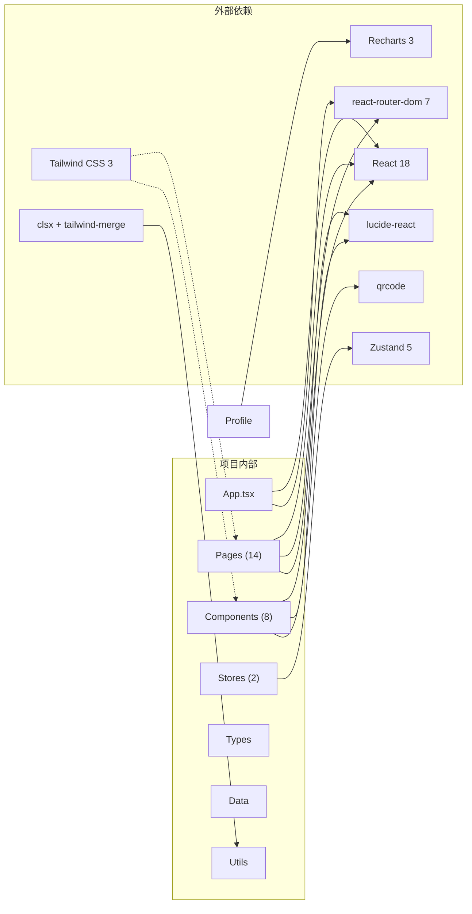

# Human Benchmark — 三层架构与依赖关系

> 项目：Human Benchmark 人类反应测试平台
> 技术栈：React 18 + TypeScript + Vite + Zustand + Tailwind CSS + Recharts

---

## 一、三层总览

```
┌─────────────────────────────────────────────────────────────────┐
│                     组件层 (Component Layer)                     │
│   Pages (14) · Shared Components (8) · Hooks (1)                │
│   ──── 渲染 UI、响应用户交互 ────                                │
├─────────────────────────────────────────────────────────────────┤
│                     逻辑层 (Logic Layer)                         │
│   useScoreStore · useTrainingStore · useTheme · utils            │
│   ──── 业务规则、状态流转、成就判定 ────                          │
├─────────────────────────────────────────────────────────────────┤
│                     数据层 (Data Layer)                          │
│   types/index.ts · data/achievements.ts · localStorage(persist) │
│   ──── 类型定义、常量配置、持久化存储 ────                        │
└─────────────────────────────────────────────────────────────────┘
```

---

## 二、三层 Mermaid 架构图

```mermaid
graph TB
  subgraph ComponentLayer["🖥️ 组件层 (Component Layer)"]
    direction TB

    subgraph Pages["📄 页面组件 (Pages)"]
      Home["Home"]
      Profile["Profile"]
      TrainingPlans["TrainingPlans"]
      TrainingPlanEditor["TrainingPlanEditor"]
      TrainingSessionPage["TrainingSessionPage"]
      ReactionTime["ReactionTime"]
      NumberMemory["NumberMemory"]
      TypingSpeed["TypingSpeed"]
      AimTrainer["AimTrainer"]
      ChimpTest["ChimpTest"]
      ColorVision["ColorVision"]
      SequenceMemory["SequenceMemory"]
      StroopTest["StroopTest"]
      MathSpeed["MathSpeed"]
    end

    subgraph SharedComponents["🧩 共享组件 (Components)"]
      Header["Header"]
      TestCard["TestCard"]
      TestLayout["TestLayout"]
      ResultDisplay["ResultDisplay"]
      DifficultySelector["DifficultySelector"]
      ShareResult["ShareResult"]
      AchievementCelebration["AchievementCelebration"]
      Empty["Empty"]
    end

    subgraph Hooks["🪝 自定义 Hooks"]
      useTheme["useTheme"]
    end
  end

  subgraph LogicLayer["⚙️ 逻辑层 (Logic Layer)"]
    direction TB

    useScoreStore["useScoreStore<br/>成绩记录·成就判定·归一化评分"]
    useTrainingStore["useTrainingStore<br/>训练计划·会话管理·每日生成"]
    cn["cn() (lib/utils)<br/>样式合并工具"]
  end

  subgraph DataLayer["💾 数据层 (Data Layer)"]
    direction TB

    subgraph Types["📐 类型定义 (types/index.ts)"]
      TestId["TestId · TestMeta · ScoreRecord"]
      TestRecord["TestRecord · ScoreHistoryPoint"]
      Achievement["Achievement · AchievementContext"]
      TrainingPlan["TrainingPlan · TrainingSession"]
      DifficultyLevel["DifficultyLevel · 各难度配置"]
    end

    subgraph StaticData["📊 静态数据"]
      TESTS["TESTS (9项测试元数据)"]
      ABILITIES["ABILITIES (6大能力维度)"]
      ACHIEVEMENTS["ACHIEVEMENTS (20个成就)"]
      RARITY_INFO["RARITY_INFO (稀有度样式)"]
      DIFFICULTY["难度配置常量<br/>REACTION/NUMBER_MEMORY/...<br/>_DIFFICULTY"]
      TRAINING_TEMPLATES["TRAINING_TEMPLATES<br/>(5个训练模板)"]
    end

    subgraph Persistence["💿 持久化"]
      LS_Score["localStorage<br/>human-benchmark-scores"]
      LS_Training["localStorage<br/>human-benchmark-training"]
      LS_Theme["localStorage<br/>theme"]
    end
  end

  %% === 组件层 → 逻辑层 依赖 ===
  Home --> useTrainingStore
  Home --> Header
  Home --> TestCard
  Profile --> useScoreStore
  TrainingPlans --> useTrainingStore
  TrainingPlans --> Header
  TrainingPlanEditor --> useTrainingStore
  TrainingPlanEditor --> Header
  TrainingSessionPage --> useTrainingStore
  TrainingSessionPage --> useScoreStore

  ReactionTime --> useScoreStore
  ReactionTime --> TestLayout
  ReactionTime --> ResultDisplay
  ReactionTime --> DifficultySelector
  NumberMemory --> useScoreStore
  NumberMemory --> TestLayout
  NumberMemory --> ResultDisplay
  NumberMemory --> DifficultySelector
  TypingSpeed --> useScoreStore
  TypingSpeed --> TestLayout
  TypingSpeed --> ResultDisplay
  TypingSpeed --> DifficultySelector
  AimTrainer --> useScoreStore
  AimTrainer --> TestLayout
  AimTrainer --> ResultDisplay
  AimTrainer --> DifficultySelector
  ChimpTest --> useScoreStore
  ChimpTest --> TestLayout
  ChimpTest --> ResultDisplay
  ChimpTest --> DifficultySelector
  ColorVision --> useScoreStore
  ColorVision --> TestLayout
  ColorVision --> ResultDisplay
  ColorVision --> DifficultySelector
  SequenceMemory --> useScoreStore
  SequenceMemory --> TestLayout
  SequenceMemory --> ResultDisplay
  SequenceMemory --> DifficultySelector
  StroopTest --> useScoreStore
  StroopTest --> TestLayout
  StroopTest --> ResultDisplay
  StroopTest --> DifficultySelector
  MathSpeed --> useScoreStore
  MathSpeed --> TestLayout
  MathSpeed --> ResultDisplay
  MathSpeed --> DifficultySelector

  Header --> useScoreStore
  Header --> useTrainingStore
  TestCard --> useScoreStore
  TestLayout --> useScoreStore
  ResultDisplay --> useScoreStore
  ResultDisplay --> useTrainingStore
  ResultDisplay --> ShareResult
  ShareResult --> useScoreStore
  AchievementCelebration --> ACHIEVEMENTS
  AchievementCelebration --> RARITY_INFO
  AchievementCelebration --> cn

  %% === 逻辑层 → 数据层 依赖 ===
  useScoreStore --> TestId
  useScoreStore --> TestRecord
  useScoreStore --> Achievement
  useScoreStore --> TESTS
  useScoreStore --> ABILITIES
  useScoreStore --> ACHIEVEMENTS
  useScoreStore --> LS_Score

  useTrainingStore --> TrainingPlan
  useTrainingStore --> TrainingSession
  useTrainingStore --> TRAINING_TEMPLATES
  useTrainingStore --> TESTS
  useTrainingStore --> LS_Training

  useTheme --> LS_Theme

  %% === 组件层 → 数据层 直接依赖 ===
  Home -.-> TESTS
  Profile -.-> TESTS
  Profile -.-> ABILITIES
  Profile -.-> ACHIEVEMENTS
  Profile -.-> RARITY_INFO
  Profile -.-> cn
  TrainingPlans -.-> TRAINING_TEMPLATES
  TrainingPlans -.-> TESTS
  TrainingPlanEditor -.-> TESTS
  TrainingSessionPage -.-> TESTS
  DifficultySelector -.-> DIFFICULTY
  ReactionTime -.-> TESTS
  ReactionTime -.-> DIFFICULTY
  NumberMemory -.-> TESTS
  NumberMemory -.-> DIFFICULTY
  TypingSpeed -.-> TESTS
  TypingSpeed -.-> DIFFICULTY
  AimTrainer -.-> TESTS
  AimTrainer -.-> DIFFICULTY
  ChimpTest -.-> TESTS
  ChimpTest -.-> DIFFICULTY
  ColorVision -.-> TESTS
  ColorVision -.-> DIFFICULTY
  SequenceMemory -.-> TESTS
  SequenceMemory -.-> DIFFICULTY
  StroopTest -.-> TESTS
  StroopTest -.-> DIFFICULTY
  MathSpeed -.-> TESTS
  MathSpeed -.-> DIFFICULTY

  %% 样式
  classDef component fill:#1e293b,stroke:#38bdf8,color:#e2e8f0
  classDef logic fill:#1e1b4b,stroke:#818cf8,color:#e2e8f0
  classDef data fill:#14532d,stroke:#4ade80,color:#e2e8f0
  classDef persist fill:#451a03,stroke:#fbbf24,color:#e2e8f0
  class Home,Profile,TrainingPlans,TrainingPlanEditor,TrainingSessionPage,ReactionTime,NumberMemory,TypingSpeed,AimTrainer,ChimpTest,ColorVision,SequenceMemory,StroopTest,MathSpeed component
  class Header,TestCard,TestLayout,ResultDisplay,DifficultySelector,ShareResult,AchievementCelebration,Empty component
  class useTheme component
  class useScoreStore,useTrainingStore,cn logic
  class TestId,TestRecord,Achievement,TrainingPlan,DifficultyLevel,TESTS,ABILITIES,ACHIEVEMENTS,RARITY_INFO,DIFFICULTY,TRAINING_TEMPLATES data
  class LS_Score,LS_Training,LS_Theme persist
```



---

## 三、各层详细说明

### 3.1 组件层 (Component Layer)

#### 页面组件 — `src/pages/`

| 页面 | 路由 | 依赖的组件 | 依赖的 Store | 依赖的 Types/Data |
|------|------|-----------|-------------|------------------|
| Home | `/` | Header, TestCard | useTrainingStore | TESTS |
| Profile | `/profile` | — | useScoreStore | TESTS, ABILITIES, ACHIEVEMENTS, RARITY_INFO, cn |
| TrainingPlans | `/training` | Header | useTrainingStore | TRAINING_TEMPLATES, TESTS |
| TrainingPlanEditor | `/training/new`, `/training/edit/:id` | Header | useTrainingStore | TESTS, TestId, TrainingPlanItem |
| TrainingSessionPage | `/training/session` | — | useTrainingStore, useScoreStore | TESTS, TrainingSessionItem |
| ReactionTime | `/reaction` | TestLayout, ResultDisplay, DifficultySelector | useScoreStore | TESTS, REACTION_MODES, REACTION_DIFFICULTY, DifficultyLevel |
| NumberMemory | `/number-memory` | TestLayout, ResultDisplay, DifficultySelector | useScoreStore | TESTS, NUMBER_MEMORY_DIFFICULTY, DifficultyLevel |
| TypingSpeed | `/typing` | TestLayout, ResultDisplay, DifficultySelector | useScoreStore | TESTS, TYPING_DIFFICULTY, DifficultyLevel |
| AimTrainer | `/aim` | TestLayout, ResultDisplay, DifficultySelector | useScoreStore | TESTS, AIM_DIFFICULTY, DifficultyLevel |
| ChimpTest | `/chimp` | TestLayout, ResultDisplay, DifficultySelector | useScoreStore | TESTS, CHIMP_DIFFICULTY, DifficultyLevel |
| ColorVision | `/color-vision` | TestLayout, ResultDisplay, DifficultySelector | useScoreStore | TESTS, COLOR_VISION_DIFFICULTY, DifficultyLevel |
| SequenceMemory | `/sequence-memory` | TestLayout, ResultDisplay, DifficultySelector | useScoreStore | TESTS, SEQUENCE_DIFFICULTY, DifficultyLevel |
| StroopTest | `/stroop` | TestLayout, ResultDisplay, DifficultySelector | useScoreStore | TESTS, STROOP_DIFFICULTY, DifficultyLevel |
| MathSpeed | `/math-speed` | TestLayout, ResultDisplay, DifficultySelector | useScoreStore | TESTS, MATH_DIFFICULTY, DifficultyLevel |

#### 共享组件 — `src/components/`

| 组件 | 职责 | 依赖的 Store | 依赖的 Types/Data |
|------|------|-------------|------------------|
| Header | 全局导航栏，显示统计信息 | useScoreStore, useTrainingStore | — |
| TestCard | 首页测试卡片 | useScoreStore | TestMeta |
| TestLayout | 测试页面公共布局（返回+最佳成绩） | useScoreStore | TestMeta |
| ResultDisplay | 测试结果展示（普通+训练模式） | useScoreStore, useTrainingStore | TestMeta, ShareResult |
| DifficultySelector | 难度选择器 | — | DIFFICULTY_OPTIONS, DifficultyLevel |
| ShareResult | 成绩分享（图片生成+二维码） | useScoreStore (REFERENCE_SCORES) | TestMeta, QRCode |
| AchievementCelebration | 成就解锁庆祝动画 | — | ACHIEVEMENTS, RARITY_INFO, cn |
| Empty | 空状态占位 | — | cn |

#### 自定义 Hooks — `src/hooks/`

| Hook | 职责 | 依赖 |
|------|------|------|
| useTheme | 暗色/亮色主题切换 | localStorage |

---

### 3.2 逻辑层 (Logic Layer)

#### useScoreStore — `src/store/useScoreStore.ts`

核心成绩管理 Store，职责：

```
useScoreStore
├── 状态
│   ├── records: Partial<Record<TestId, ScoreRecord>>   # 各测试成绩记录
│   ├── allTestRecords: TestRecord[]                     # 全部测试记录流水
│   ├── unlockedAchievements: UnlockedAchievement[]      # 已解锁成就
│   └── newlyUnlockedAchievements: string[]              # 新解锁成就(通知用)
├── 写入操作
│   ├── updateScore()        → 更新成绩 + 触发成就检测
│   └── checkAchievementsOnProfileLoad() → 档面加载时检测成就
├── 读取操作
│   ├── getBestScore()       → 获取某测试最佳成绩
│   ├── getLastScore()       → 获取最近一次成绩
│   ├── getAttempts()        → 获取尝试次数
│   ├── getHistory()         → 获取历史曲线数据
│   ├── getNormalizedScore() → 归一化评分 (0-100)
│   ├── getAbilityScore()    → 能力维度得分
│   ├── getTotalDuration()   → 总测试时长
│   └── getTestRecordsByFilter() → 按条件筛选记录
└── 持久化
    └── localStorage: "human-benchmark-scores"
```

**成就判定流程**：

```
updateScore() 被调用
  ├── 计算新成绩 → 更新 records + allTestRecords
  ├── 构建 AchievementContext
  ├── 遍历 ACHIEVEMENTS:
  │   ├── 跳过已解锁的
  │   ├── 跳过 checkOn 不包含 'test-complete' 的
  │   └── 执行 condition(ctx) → 满足则加入 newlyUnlocked
  └── set() 更新状态 → 触发 App.tsx AchievementWatcher
```

#### useTrainingStore — `src/store/useTrainingStore.ts`

训练计划管理 Store，职责：

```
useTrainingStore
├── 状态
│   ├── plans: TrainingPlan[]              # 自定义训练计划
│   ├── currentSession: TrainingSession    # 当前进行中的训练会话
│   ├── dailyTraining: DailyTraining       # 每日训练
│   └── completedSessions: string[]        # 已完成的会话ID
├── 计划管理
│   ├── createPlan()         → 创建自定义计划
│   ├── updatePlan()         → 更新计划
│   ├── deletePlan()         → 删除计划
│   ├── duplicatePlan()      → 复制计划
│   ├── getPlan()            → 获取单个计划
│   └── createFromTemplate() → 从模板创建计划
├── 每日训练
│   ├── getDailyTraining()   → 获取/生成当日训练 (seeded random)
│   └── markDailyCompleted() → 标记当日训练完成
├── 会话管理
│   ├── startSession()           → 从计划ID启动会话
│   ├── startSessionFromPlan()   → 从计划对象启动会话
│   ├── getCurrentTest()         → 获取当前测试项
│   ├── completeCurrentRound()   → 完成当前轮次
│   ├── nextItem()               → 跳到下一项
│   ├── completeSession()        → 完成整个会话
│   ├── cancelSession()          → 取消会话
│   └── getSessionProgress()     → 获取进度百分比
└── 持久化
    └── localStorage: "human-benchmark-training"
```

#### 工具函数 — `src/lib/utils.ts`

| 函数 | 用途 | 依赖 |
|------|------|------|
| `cn()` | 合并 Tailwind CSS 类名 (clsx + twMerge) | clsx, tailwind-merge |

---

### 3.3 数据层 (Data Layer)

#### 类型系统 — `src/types/index.ts`

```
types/index.ts
├── 测试相关
│   ├── TestId                    # 9种测试的联合类型
│   ├── TestMeta                  # 测试元数据 (名称/路由/单位/颜色)
│   ├── TESTS: TestMeta[]         # 9项测试的完整配置
│   └── ABILITIES: AbilityInfo[]  # 6大能力维度 → 测试映射
├── 成绩相关
│   ├── ScoreRecord               # 单测试的成绩汇总
│   ├── ScoreHistoryPoint         # 历史曲线数据点
│   └── TestRecord                # 单次测试完整记录
├── 难度相关
│   ├── DifficultyLevel           # 'easy' | 'normal' | 'hard'
│   ├── DIFFICULTY_OPTIONS        # 难度选项展示配置
│   ├── REACTION_DIFFICULTY       # 反应测试难度参数
│   ├── NUMBER_MEMORY_DIFFICULTY  # 数字记忆难度参数
│   ├── TYPING_DIFFICULTY         # 打字速度难度参数
│   ├── AIM_DIFFICULTY            # 瞄准测试难度参数
│   ├── CHIMP_DIFFICULTY          # 黑猩猩测试难度参数
│   ├── COLOR_VISION_DIFFICULTY   # 颜色视觉难度参数
│   ├── SEQUENCE_DIFFICULTY       # 序列记忆难度参数
│   ├── STROOP_DIFFICULTY         # Stroop难度参数
│   └── MATH_DIFFICULTY           # 数学速度难度参数
├── 反应模式
│   ├── ReactionMode              # 5种反应模式类型
│   └── REACTION_MODES            # 模式展示配置
├── 成就相关
│   ├── Achievement               # 成就定义 (含 condition 函数)
│   ├── AchievementContext        # 成就判定上下文
│   ├── UnlockedAchievement       # 已解锁成就记录
│   └── AchievementRarity         # 稀有度类型
├── 训练相关
│   ├── TrainingPlan              # 训练计划
│   ├── TrainingPlanItem          # 计划中的测试项
│   ├── TrainingSession           # 训练会话 (运行时)
│   ├── TrainingSessionItem       # 会话中的测试项
│   ├── DailyTraining             # 每日训练
│   ├── TrainingPlanTemplate      # 训练模板
│   ├── TrainingPlanTemplateType  # 模板类型
│   └── TRAINING_TEMPLATES        # 5个内置模板
└── 能力维度
    ├── AbilityDimension          # 6大维度类型
    └── AbilityInfo               # 维度信息
```

#### 静态数据 — `src/data/achievements.ts`

| 导出 | 说明 | 数量 |
|------|------|------|
| ACHIEVEMENTS | 成就定义数组 (含判定函数) | 20 个 |
| RARITY_INFO | 稀有度样式映射 | 4 级 (common/rare/epic/legendary) |

---

## 四、依赖关系 ASCII 图

### 4.1 层间依赖（自上而下）

```
┌────────────────────────────────────────────────────────────────────┐
│                        组件层 (Component)                          │
│                                                                    │
│  ┌──────────┐  ┌──────────┐  ┌──────────┐       ┌──────────────┐ │
│  │  Pages    │  │Components│  │  Hooks   │       │   App.tsx    │ │
│  │  (14个)   │  │  (8个)   │  │ useTheme │       │ Router+Watcher│ │
│  └────┬─────┘  └────┬─────┘  └────┬─────┘       └──────┬───────┘ │
│       │              │              │                     │         │
│       │    ┌─────────┴──────────┐   │                     │         │
│       │    │ 共用组件链:         │   │                     │         │
│       │    │ TestLayout →        │   │                     │         │
│       │    │  ResultDisplay →    │   │                     │         │
│       │    │   ShareResult       │   │                     │         │
│       │    │ DifficultySelector  │   │                     │         │
│       │    └─────────┬──────────┘   │                     │         │
╞═══════╪══════════════╪══════════════╪═════════════════════╪═════════╡
│       │              │              │                     │         │
│       ▼              ▼              ▼                     ▼         │
│  ┌─────────────────────────────────────────────────────────────┐   │
│  │                    逻辑层 (Logic)                            │   │
│  │                                                             │   │
│  │  ┌──────────────┐  ┌───────────────┐  ┌────────────────┐   │   │
│  │  │ useScoreStore│  │useTrainingStore│  │  cn() (utils)  │   │   │
│  │  │ ·成绩记录    │  │ ·训练计划      │  │ ·样式合并      │   │   │
│  │  │ ·成就检测    │  │ ·会话管理      │  └────────────────┘   │   │
│  │  │ ·归一化评分  │  │ ·每日生成      │                        │   │
│  │  └──────┬───────┘  └──────┬────────┘                        │   │
│  │         │                  │                                  │   │
│  ╞═════════╪══════════════════╪══════════════════════════════════╡   │
│  │         │                  │                                  │   │
│  │         ▼                  ▼                                  │   │
│  │  ┌─────────────────────────────────────────────────────────┐ │   │
│  │  │                 数据层 (Data)                            │ │   │
│  │  │                                                         │ │   │
│  │  │  ┌──────────────┐  ┌───────────────┐  ┌──────────────┐│ │   │
│  │  │  │ types/       │  │ data/         │  │ localStorage ││ │   │
│  │  │  │ index.ts     │  │ achievements  │  │ (zustand     ││ │   │
│  │  │  │              │  │ .ts           │  │  persist)    ││ │   │
│  │  │  │ ·类型定义    │  │ ·20个成就     │  │              ││ │   │
│  │  │  │ ·TESTS常量   │  │ ·稀有度样式   │  │ ·scores      ││ │   │
│  │  │  │ ·ABILITIES   │  └───────────────┘  │ ·training    ││ │   │
│  │  │  │ ·难度配置    │                      │ ·theme       ││ │   │
│  │  │  │ ·训练模板    │                      └──────────────┘│ │   │
│  │  │  └──────────────┘                                       │ │   │
│  │  └─────────────────────────────────────────────────────────┘ │   │
│  └─────────────────────────────────────────────────────────────────┘
```

### 4.2 测试页面统一依赖模式

所有 9 个测试页面遵循完全一致的依赖模式：

```
┌─────────────────────────────────────────┐
│          任意测试页面 (e.g. ReactionTime) │
│                                         │
│  imports:                               │
│    ├── TestLayout       ← 公共布局      │
│    ├── ResultDisplay    ← 结果展示      │
│    ├── DifficultySelector ← 难度选择    │
│    ├── useScoreStore    ← 成绩写入      │
│    ├── TESTS            ← 测试元数据    │
│    └── XXX_DIFFICULTY   ← 对应难度配置  │
│                                         │
│  渲染流程:                               │
│    1. DifficultySelector → 选择难度      │
│    2. 游戏逻辑 (useState/useRef)        │
│    3. useScoreStore.updateScore()        │
│    4. ResultDisplay → 展示结果          │
└─────────────────────────────────────────┘
```

### 4.3 成就系统数据流

```
测试页面                     逻辑层                          数据层
─────────                   ──────                         ──────

用户完成测试
    │
    ▼
updateScore(testId, score)
    │
    ├──→ 计算 bestScore / isBest
    ├──→ 构建 TestRecord
    ├──→ 更新 records[] + allTestRecords[]
    │
    ├──→ 构建 AchievementContext  ──────→  types/AchievementContext
    │                                    types/ScoreRecord
    │                                    types/TestRecord
    │
    ├──→ 遍历 ACHIEVEMENTS  ──────────→  data/achievements.ts
    │    ├── 跳过已解锁
    │    ├── 跳过 checkOn 不匹配
    │    └── condition(ctx) 判定
    │         │
    │         ▼
    │    newlyUnlockedAchievements[]
    │
    ▼
App.tsx AchievementWatcher
    │
    ├──→ 监听 newlyUnlocked
    └──→ 渲染 AchievementCelebration ──→  data/achievements.ts (RARITY_INFO)
                                         lib/utils.ts (cn)
```

### 4.4 训练系统数据流

```
用户操作                     逻辑层                          数据层
─────────                   ──────                         ──────

选择训练计划
    │
    ▼
startSession(planId)  ────────→  useTrainingStore
    │                              ├── 创建 TrainingSession
    │                              └── 设置 currentSession
    ▼
TrainingSessionPage
    │
    ├──→ getCurrentTest()
    ├──→ navigate(testRoute?training=1)
    │
    ▼
测试页面 (training mode)
    │
    ├──→ 完成测试
    ├──→ ResultDisplay 检测 ?training=1
    ├──→ completeCurrentRound(score)  ──→  useTrainingStore
    │                                    ├── 更新 session item
    │                                    └── 检查是否全部完成
    ▼
返回 TrainingSessionPage
    │
    ├──→ nextItem() → 下一测试
    └──→ 全部完成 → completeSession()
                      └──→ markDailyCompleted() (如果是每日训练)
```

---

## 五、外部依赖关系



---

## 六、关键文件索引

| 层级 | 文件 | 职责 |
|------|------|------|
| 入口 | src/main.tsx | 应用挂载点 |
| 入口 | src/App.tsx | 路由配置 + 成就监听 |
| 组件 | src/components/Header.tsx | 全局导航 |
| 组件 | src/components/TestLayout.tsx | 测试页公共布局 |
| 组件 | src/components/ResultDisplay.tsx | 成绩结果展示 |
| 组件 | src/components/DifficultySelector.tsx | 难度选择 |
| 组件 | src/components/ShareResult.tsx | 成绩分享 |
| 组件 | src/components/AchievementCelebration.tsx | 成就庆祝动画 |
| 组件 | src/components/TestCard.tsx | 首页测试卡片 |
| 逻辑 | src/store/useScoreStore.ts | 成绩+成就状态管理 |
| 逻辑 | src/store/useTrainingStore.ts | 训练计划状态管理 |
| 逻辑 | src/hooks/useTheme.ts | 主题切换 |
| 逻辑 | src/lib/utils.ts | cn() 工具函数 |
| 数据 | src/types/index.ts | 全部类型+常量定义 |
| 数据 | src/data/achievements.ts | 成就数据+稀有度样式 |
